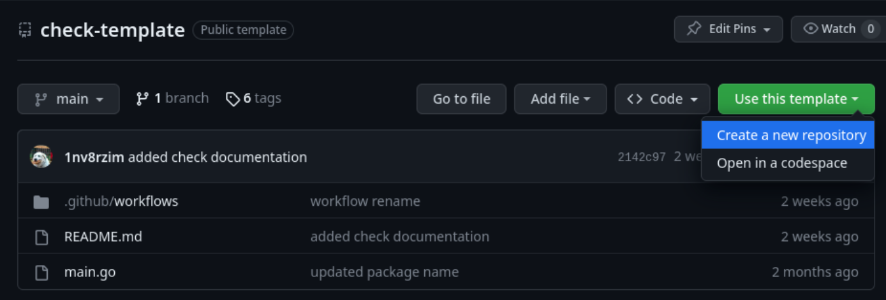

# Create a Custom Check

1. Create a new check repo based on [compscore/check-template](https://github.com/compscore/check-template)  
   
2. Clone newly created repo
   ```sh
   git clone github.com/<organization>/<repository>.git
   cd <repository>
   ```
3. Create go package
   ```sh
   go mod init github.com/<organization>/<repository>
   go mod tidy
   ```
4. Write custom scorecheck implementation
   ```go
   # main.go
   package <repository>
   ...
   func Run(ctx context.Context, target string, command string, expectedOutput string, username string, password string, options map[string]interface{}) (bool, string) {
    <scorecheck code>
   	return <check success>, <check error message>
   }
   ```
5. Commit, Push, and Tag Code
   ```sh
   git add .
   git commit -m "<commit message>"
   git push
   git tag v1.0.0 # or newest semantic version
   git push --tags
   ```
6. Import code into Compscore Server
   ```yml
   # config.yml
   ---
   checks:
     - name: <name of check>
       release:
         org: <organization>
         repo: <repository>
         tag: latest # or tag of commit to use
   ```
